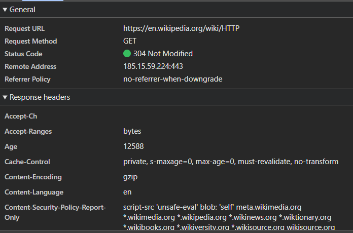
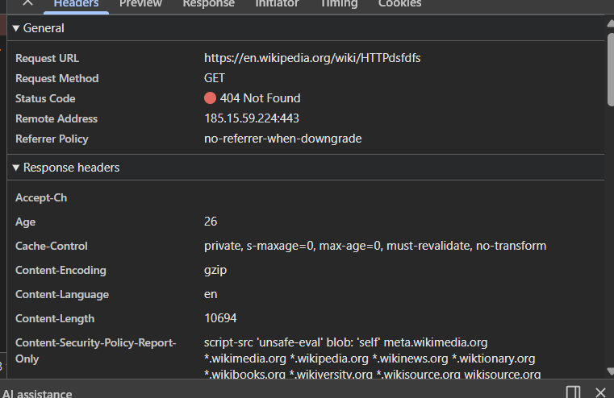
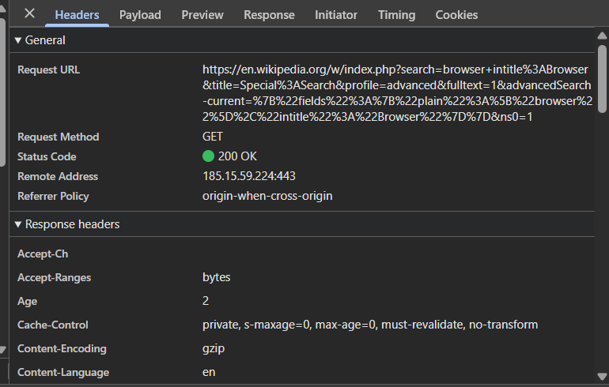
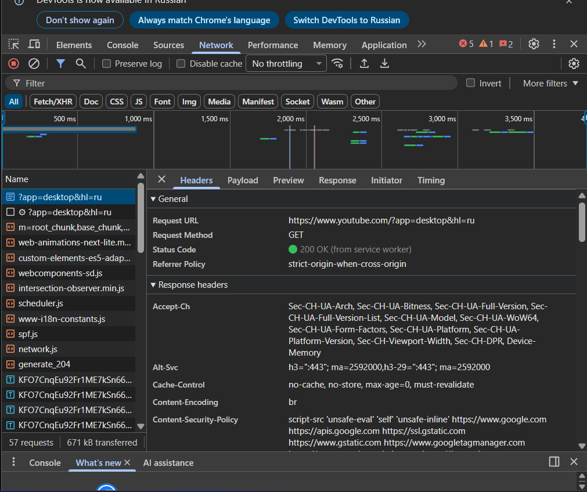

# Лабораторная работа №1. HTTP

## Цель работы

- Понять, что происходит, когда пользователь открывает сайт.
- Научиться находить и анализировать HTTP-запросы в браузере.
- Разобраться в назначении методов `GET`, `POST`, `PUT`, `DELETE`.

## Условие

### Задание 1. Анализ HTTP-запросов. Часть 1

1. Откройте сайт Wikipedia: [https://en.wikipedia.org/wiki/HTTP](https://en.wikipedia.org/wiki/HTTP)
2. Прочитайте статью и обратите внимание на разделы, посвященные HTTP-запросам.
3. Откройте инструменты разработчика в вашем браузере (обычно это можно сделать, нажав F12 или правой кнопкой мыши выбрав "Inspect").
4. Перейдите на вкладку "`Network`" (Сеть).
5. Обновите страницу Wikipedia.
6. Найдите первый запрос к странице, он будет назван как `HTTP` и изучите следующие аспекты:

   - URL запроса - https://en.wikipedia.org/wiki/HTTP
   - Метод запроса. Метод запроса get, так как данные не отправляюьстя, а только запрашиваются. 
   - Статус ответа. 304 Not Modified  Этот статус означает, что страница не изменялись с последнего запроса, и браузер моежет использовать закешированную версию. 
   - Заголовки запроса и ответа. Accept-Ranges: bytes
                                    Сервер поддерживает частичную загрузку файла (по байтам).
                                Age: 12588
                                    Показывает, сколько секунд ресурс находится в кэше.

                                Cache-Control: private, s-maxage=0, max-age=0, must-revalidate, no-transform
                                Управляет кэшированием:

                                max-age=0 — нужно проверять актуальность;

                                must-revalidate — обязательно проверять у сервера;

                                private — кэш только для конкретного пользователя.

                                Content-Encoding: gzip
                                Ответ сжат с помощью gzip для уменьшения размера.

                                Content-Language: en
                                Язык содержимого — английский.

                                Content-Security-Policy-Report-Only
                                Политика безопасности — какие источники скриптов и ресурсов разрешены.
   - Есть ли тело запроса или ответа? У get запроса нет тела.

8. Сделайте скриншот с информацией о запросе и сохраните его.
9. Перейдите по следующему адресу: [https://en.wikipedia.org/wiki/HTTPdsfdfs](https://en.wikipedia.org/wiki/HTTPdsfdfs) и повторите анализ для этого запроса. _Какой статус ответа вы получили и почему?_ 
Я получил статус ответа 404 Not Found. Это означает, что сввязь с сервером установлена, запрос корректный, но ресусра по такому запросу адресу нет.
 

### Задание 2. Анализ HTTP-запросов. Часть 2

1. Перейдите на: [https://en.wikipedia.org/wiki/Special:Search](https://en.wikipedia.org/wiki/Special:Search)
2. Выполните поиск по слову `browser` ([Пример](https://img.lightshot.app/xzxlJ6m8Qn2Y5ATMeyYsbg.png)).
3. Найдите запрос поиска в `Network`.
4. Изучите следующие аспекты:

   - URL запроса. https://en.wikipedia.org/w/index.php?search=browser+intitle%3ABrowser&title=Special%3ASearch&profile=advanced&fulltext=1&advancedSearch-current=%7B%22fields%22%3A%7B%22plain%22%3A%5B%22browser%22%5D%2C%22intitle%22%3A%22Browser%22%7D%7D&ns0=1
   - Метод запроса. Использовался метод Get. GET подходит для операций чтения.
   - Query Parameters. search=browser
                            Это поисковый запрос.
                            Значение browser — слово, которое пользователь ввёл. Используется сервером для поиска совпадений.

                            title=Special%3ASearch
                            %3A — это код символа :
                            Расшифровка: Special:Search
                            Указывает, что используется специальная страница поиска Wikipedia.

                            ns0=1
                            ns = namespace (пространство имён)
                            ns0=1 означает поиск в основном пространстве статей.
                            Может быть несколько параметров ns, если поиск выполняется в разных разделах.

5. Сделайте скриншот с информацией о запросе и сохраните его.

### Задание 3. Анализ HTTP-запросов. Часть 3

Повторите _анализ_ HTTP-запроса для одного сайта на выбор:

1. [https://www.google.com](https://www.google.com)
2. [https://www.youtube.com](https://www.youtube.com)
3. [https://github.com](https://github.com)
 URL запроса - https://www.youtube.com/?app=desktop&hl=ru
                - Метод запроса. Метод запроса get, так как данные не отправляюьстя, а только запрашиваются. 
                - Статус ответа. 200 OK (from service worker) 200 OK — запрос выполнен успешно
                    from service worker — страница загружена через Service Worker.
                - Заголовки запроса и ответа.Accept-CH Передаёт клиентские характеристики браузера.
                Alt-Svc
                Сообщает о поддержке HTTP/3 (h3).
                Cache-Control
                no-cache, no-store, max-age=0, must-revalidate - страницу нельзя хранить в кэше,каждый раз нужно проверять актуальность.
                
                Content-Encoding: br - Ответ сжат алгоритмом Brotli.
                
                Content-Security-Policy - Политика безопасности — какие источники скриптов разрешены.

### Задание 4. Составление HTTP-запросов

1. Составьте GET-запрос к серверу по адресу http://sandbox.usm.com, указав в заголовке User-Agent ваше имя и фамилию.
   > Что такое User-Agent и для чего он используется?
   > User-Agent — это HTTP-заголовок, который сообщает серверу информацию о клиенте, отправляющем запрос.
2. Составьте POST-запрос к серверу по адресу http://sandbox.usm.com/cars, указав в теле запроса следующие параметры:
   - `make`: марка автомобиля (например, "Toyota")
   - `model`: модель автомобиля (например, "Corolla")
   - `year`: год выпуска автомобиля (например, 2020)
     > Какие еще методы HTTP-запросов существуют и для чего они используются?
     > PUT запрос - польностью обновление ресурса по заданному URL если он существует, если его не существует то он создается.
     > PATCH запрос - частичное обновление, изменяются тольео переданные поля.
     > DELETE - удаление ресурса
     > HEAD - получение только заголовка ответа.
     > OPTIONS - получение списка всех доступных методов для ресурса.
     > Connect - создание связи между клиентом и сервером.
     > TRACE - диагностика.   
3. Составьте PUT-запрос к серверу по адресу http://sandbox.usm.com/cars/1, указав в заголовке `User-Agent` ваше имя и фамилию, в заголовке `Content-Type` значение `application/json` и в теле запроса следующие параметры:
   ```json
   {
     "make": "Toyota",
     "model": "Corolla",
     "year": 2021
   }
   ```
   > В чем разница между PATCH и PUT запросами?
4. Напишите один из возможных вариантов ответа сервера следующий запрос:
   ```http
   POST /cars HTTP/1.1
   Host: sandbox.com
   Content-Type: application/json
   User-Agent: John Doe
   model=Corolla&make=Toyota&year=2020
   ```
   Предположите ситуации, когда сервер на запрос выше может вернуть HTTP-коды состояния 200, 201, 400, 401, 403, 404, 500.


